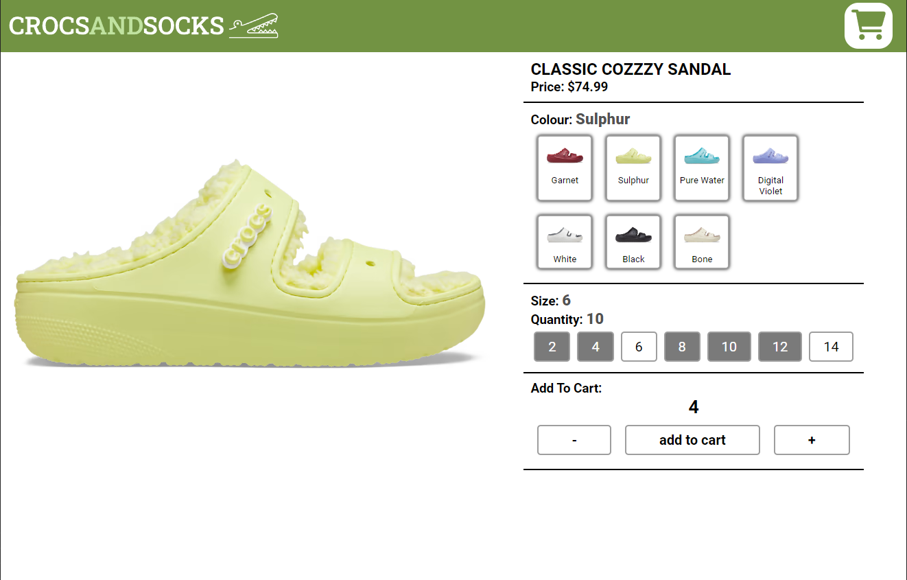

# E-Comerce Website Built With React

## [Link to Webpage](https://matt-pepper.github.io/e-Shop/)

## Stack

This website was built using:

1. React
2. FireStore
3. SCSS

## About The Project

The goal of this website was to create a website that can retrieve product data from a database,
Display all products on the home page as cards, and also have a image carousel that displays featured items.
The website also has a page for every product where you can make colour and size selections and place in stock items into a cart. The cart is stored in the database and allows the user to edit the quantity of the item in the cart and also remove items from the cart.

### Challenges

Because this was my first time using a document database, I found it challenging deciding on a good database schema.

The solution I found was to have each item be a separate document with a field for colours that contained an array of all the possible colour options, and each colour option contained an array of all the size options the size options held the quantity available for the specific shoe in a specific colour in that specific size.

Another challenge I had was populating the database with the product data, because the user interface for FireStore is actually very inefficient for manually adding products.

To overcome this I created a javascript function that took my data that was stored as a javascript object and use the FireStore API to add new records.

### What I Learnt

During this project I learnt how to add, retrieve, update and delete documents from a document database.

This project also allowed me to learn new React knowledge with the use of react hooks useEffect, useState and useMemo.
